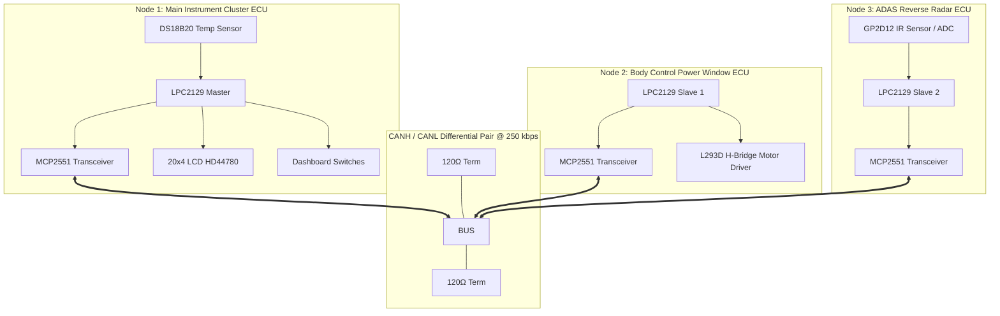

# 🚗 CAN-Based Distributed Engine Monitoring & Vehicle Control System


A high-reliability, multi-node distributed automotive ECU system designed around **NXP LPC2129 (ARM7TDMI-S)** microcontrollers, bare-metal **Embedded C**, and the **CAN 2.0B** protocol operating at **250 kbps**.

---

## 📑 Table of Contents
- [📌 Project Overview](#-project-overview)
- [🏗️ System Architecture](#️-system-architecture)
- [📡 CAN Protocol & Network Matrix](#-can-protocol--network-matrix)
- [🕹️ Distributed ECU Nodes](#️-distributed-ecu-nodes)
  - [1. Main Instrument Cluster ECU](#1-main-instrument-cluster-ecu)
  - [2. Power Window Body Control ECU](#2-power-window-body-control-ecu)
  - [3. ADAS Reverse Radar ECU](#3-adas-reverse-radar-ecu)
- [🖥️ Custom 20×4 LCD User Interface](#️-custom-204-lcd-user-interface)
- [📂 Repository Structure](#-repository-structure)
- [🛠️ Build & Simulation Setup](#️-build--simulation-setup)
- [📈 Future Roadmap](#-future-roadmap)
- [👨‍💻 Author & Credits](#-author--credits)

---

## 📌 Project Overview

Modern vehicles rely on dozens of Electronic Control Units (ECUs) exchanging critical telemetry over robust serial buses. This project implements a **3-node CAN 2.0B automotive network** that replicates real-world vehicle subsystems:

1. **Engine Telemetry & Cluster Display**: Monitored via a 1-Wire DS18B20 digital thermal sensor with multi-tier warning thresholds.
2. **Body ECU Window Control**: Actuated via an L293D H-Bridge motor driver with directional status feedback.
3. **ADAS Parking Assist**: Proximity tracking using a Sharp GP2D12 sensor with dynamic distance bar rendering.
4. **Custom HD44780 CGRAM Glyphs**: Hardware-level custom character generation for degree symbols (`°`), directional arrows (`▲`/`▼`), and solid distance blocks (`█`).

---

## 🏗️ System Architecture



---

## 📡 CAN Protocol & Network Matrix

The network operates on standard CAN 2.0B ID frames with deterministic message priorities:

| Message ID | Origin ECU | DLC | Description / Data Payload | Priority |
| :--- | :--- | :---: | :--- | :---: |
| `0x101` | Main Node | 1 | Power Window Command (`0x01`: Open, `0x02`: Close, `0x00`: Stop) | High |
| `0x102` | Main Node | 1 | ADAS Control Command (`0x01`: Enable Radar, `0x00`: Disable) | High |
| `0x103` | Main Node | 1 | Remote Telemetry Request Ping | Medium |
| `0x201` | Window Node | 2 | Window Glass State (`Byte 0`: Height %, `Byte 1`: Direction `▲/▼`) | Normal |
| `0x202` | Reverse Node | 2 | Obstacle Proximity (`Byte 0`: Distance in cm, `Byte 1`: Zone Alert Level) | Normal |

---

## 🕹️ Distributed ECU Nodes

### 1. Main Instrument Cluster ECU (`Main_Node/`)
* **Role**: Master telemetry collector and UI renderer.
* **Key Components**: LPC2129, 20×4 LCD Display, DS18B20 Temperature Sensor, External Interrupt switches (`EINT1`/`EINT2`).
* **Key Tasks**:
  * Samples engine temperature via 1-Wire protocol.
  * Processes non-blocking CAN frames from slave nodes.
  * Manages automotive splash screen, engine telemetry mode, window status mode, and ADAS radar screen.

### 2. Power Window Body Control ECU (`Window_glass_control_Node/`)
* **Role**: Actuates motor and tracks 4-step glass positioning.
* **Key Components**: LPC2129, L293D H-Bridge Driver, DC Motor.
* **Key Tasks**:
  * Listens for `0x101` execution commands from CAN bus.
  * Drives motor bidirectionally while updating glass position (0%, 33%, 66%, 100%).
  * Broadcasts current position frame (`0x201`) back to Main Node.

### 3. ADAS Reverse Radar ECU (`Reverse_alert_node/`)
* **Role**: Rear collision warning and distance measurement.
* **Key Components**: LPC2129, 10-bit On-Chip ADC Driver, Sharp GP2D12 IR Sensor.
* **Key Tasks**:
  * Digitizes analog sensor values via internal 10-bit ADC.
  * Linearizes distance readings into accurate centimeter values.
  * Transmits distance & warning zone alerts (`0x202`) over CAN.

---

## 🖥️ Custom 20×4 LCD User Interface

The main instrument cluster features dedicated 20×4 screen pages with custom CGRAM character generation:

```
+--------------------+   +--------------------+
|** ENGINE TELEMETRY |   |*** POWER WINDOW ***|
|Temp: 42°C [NORMAL] |   |State : OPENING ▲   |
|Status: ALL SYSTEMS |   |Glass Pos : [████  ]|
|CAN Bus: 250 kbps OK|   |Height    : 66%     |
+--------------------+   +--------------------+

+--------------------+   +--------------------+
|*** ADAS RADAR ***  |   |⚠️ WARNING ALERT! ⚠️ |
|Dist: 15 cm         |   |ENGINE OVERHEAT!    |
|Zone: CRITICAL 🔴   |   |Temp: 95°C          |
|Bar: [████████████] |   |PULL OVER SAFELY!   |
+--------------------+   +--------------------+
```

---

## 📂 Repository Structure

```
CAN-Based-Engine-Monitoring-and-Vehicle-Control-System/
├── Main_Node/                         # Master ECU (Instrument Cluster)
│   ├── MAIN_NODE.c                    # Execution Loop & State Machine
│   ├── CAN.c / CAN.h                  # 250 kbps CAN1 Driver
│   ├── dashboard.c / dashboard.h      # Telemetry & UI Render Logic
│   ├── LCD_functions.c / LCD.h        # HD44780 Driver & Custom CGRAM
│   ├── DS18B20.c / DS18B20.h          # 1-Wire Digital Thermal Driver
│   ├── EINT.c / EINT.h                # Debounced Button Interrupts
│   ├── Startup.s                      # ARM7 Vector Table
│   └── project_functions.c            # Non-blocking CAN Packet Parsing
│
├── Window_glass_control_Node/         # Body ECU (Power Window Driver)
│   ├── MAIN_WINDOW_NODE.c             # ECU Listener Loop
│   ├── window_control.c / .h          # L293D Motor Controller
│   ├── CAN.c / CAN.h                  # CAN Transceiver Logic
│   └── Startup.s                      # ARM7 Vector Table
│
├── Reverse_alert_node/                # ADAS ECU (Reverse Proximity Radar)
│   ├── MAIN_REVERSE_ALERT_NODE.c      # Sensor Polling Loop
│   ├── distance_sensor.c / .h         # ADC Linearization & Zone Logic
│   ├── adc.c / adc.h                  # 10-bit Successive Approx ADC
│   └── CAN.c / CAN.h                  # CAN Telemetry Output
│
├── Documentation/                     # Technical Specs & Wiring
│   ├── SYSTEM_DOCUMENTATION.md        # Deep Architecture & Flowcharts
│   ├── PINOUT_AND_WIRING.md           # Pin Connections & Schematic Notes
│   └── LCD_SCREENS_GALLERY.md         # UI Layout Reference
│
└── README.md                          # Repository Documentation
```

---

## 🛠️ Build & Simulation Setup

### 1. Build via Keil uVision
1. Open Keil uVision and load the node source files.
2. Select Target Device: **NXP → LPC2129**.
3. Set CPU Clock: **12.0 MHz** (CCLK = 60.0 MHz with $5\times$ PLL).
4. Under **Options for Target → Output**, check **Create HEX File**.
5. Build target (`F7`) to generate compiled `.hex` binaries for each node.

### 2. Simulate via Proteus VSM
1. Place 3 × **LPC2129** microcontrollers and 3 × **MCP2551** transceivers.
2. Wire `CANH` and `CANL` in parallel across all transceivers with $120\,\Omega$ termination resistors at both ends.
3. Assign the respective `.hex` firmware binary to each LPC2129 MCU.
4. Attach peripherals: **LM044L (20×4 LCD)**, **DS18B20**, **L293D + DC Motor**, and **Potentiometer/GP2D12**.
5. Run the interactive simulation.

---

## 📈 Future Roadmap
- [ ] **CAN Bus-Off & Error Passive Diagnostics**: Hardware fault recovery logic.
- [ ] **Diagnostic Trouble Codes (DTC)**: Non-volatile EEPROM fault logging.
- [ ] **FreeRTOS Port**: Task-based priority scheduling for ECU loops.
- [ ] **OBD-II Interface Compatibility**: Standardized PID query support.

---

## 👨‍💻 Author

**Embedded Systems Engineer**  
Specializing in Embedded C, Microcontrollers (ARM7 / ARM Cortex-M), CAN Bus Protocol, and Real-Time Operating Systems.

---
*If you find this project helpful, feel free to give it a ⭐ star on GitHub!*
